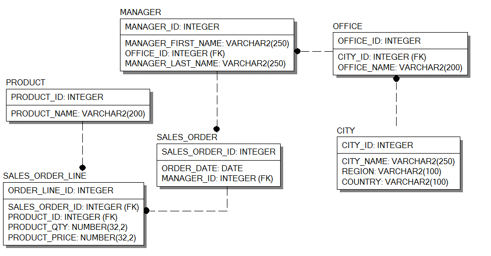
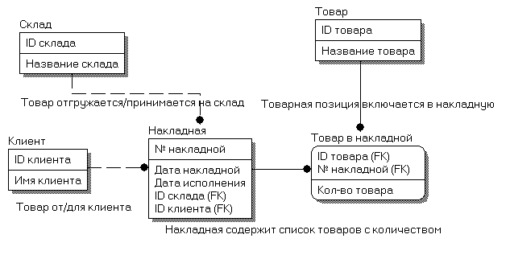

## Задание 1 - проектирование ER схемы БД

### Предметная область:

В базе данных веб-сайта StackOverflow хранятся вопросы и ответы на них.
Каждому вопросу может соответствовать ноль или более ответов, но только один ответ может быть отмечен как верный

### Задача

1. опишите нормализованную структуру таблиц реляционной базы данных, указав: первичные и внешние ключи, атрибуты и их типы данных.

2. Опишите преимущества и недостатки вашей схемы.

## Задание 2 - Базовый SQL

Необходимо написать SQL запросы:

1.Выбрать все заказы (SALES_ORDER)

2.Выбрать все заказы, введенные после 1 января 2016 года

3.Выбрать все заказы, введенные после 1 января 2016 года и до 15 июля 2016 года

4.Найти менеджеров с именем 'Henry'

5.Выбрать все заказы менеджеров с именем Henry

6.Выбрать все уникальные страны из таблицы CITY

7.Выбрать все уникальные комбинации страны и региона из таблицы CITY

8.Выбрать все страны из таблицы CITY с количеством городов в них.

9.Выбрать количество товаров (QTY), проданное с 1 по 30 января 2016 года.

10.Выбрать все уникальные названия городов, регионов и стран в одной колонке

11.Вывести имена и фамилии менеджер(ов), продавшего товаров в январе 2016 года на наибольшую сумму.

## Задание 3 - Аналитика в SQL

Данные со всех таблицы сджойнены в одну таблицу V_FACT_SALE

Необходимо написать SQL запросы, используя аналитические запросы:

1. Каждый месяц компания выдает премию в размере 5% от суммы продаж менеджеру, который за предыдущие 3 месяца продал товаров на самую большую сумму
   Выведите месяц, manager_id, manager_first_name, manager_last_name, премию за период с января по декабрь 2014 года

2. Компания хочет оптимизировать количество офисов, проанализировав относительные объемы продаж по офисам в течение периода с 2013-2014 гг.
   Выведите год, office_id, city_name, country, относительный объем продаж за текущий год
   Офисы, которые демонстрируют наименьший относительный объем в течение двух лет скорее всего будут закрыты.

3. Для планирования закупок, компанию оценивает динамику роста продаж по товарам.
   Динамика оценивается как отношение объема продаж в текущем месяце к предыдущему.
   Выведите товары, которые демонстрировали наиболее высокие темпы роста продаж в течение первого полугодия 2014 года.

4. Напишите запрос, который выводит отчет о прибыли компании за 2014 год: помесячно и поквартально.
   Отчет включает сумму прибыли за период и накопительную сумму прибыли с начала года по текущий период.

5. Найдите вклад в общую прибыль за 2014 год 10% наиболее дорогих товаров и 10% наиболее дешевых товаров.
   Выведите product_id, product_name, total_sale_amount, percent

6. Компания хочет премировать трех наиболее продуктивных (по объему продаж, конечно) менеджеров в каждой стране в 2014 году.
   Выведите country, <список manager_last_name manager_first_name, разделенный запятыми> которым будет выплачена премия

7. Выведите самый дешевый и самый дорогой товар, проданный за каждый месяц в течение 2014 года.
   cheapest_product_id, cheapest_product_name, expensive_product_id, expensive_product_name, month, cheapest_price, expensive_price

8. Менеджер получает оклад в 30 000 + 5% от суммы своих продаж в месяц. Средняя наценка стоимости товара - 10%
   Посчитайте прибыль предприятия за 2014 год по месяцам (сумма продаж - (исходная стоимость товаров + зарплата))
   month, sales_amount, salary_amount, profit_amount

## Задание 4 - Индексы БД

Заполните таблицы в приложенном документе:

+  если индекс полностью подходит

+/-  если индекс подходит, но есть варианты лучше

-/+  если индекс не очень подходит, но иногда может использоваться

-  если индекс не может использоваться в запросе

## Задание 5 - Иерархические запросы

1. Вывести все директории в виде:

ID, Название, Путь до корня

2. Для каждой директории посчитать объем занимаемого места на диске (с учетом всех вложенных папок)

ID, Название, Путь до корня, total_size

3. Добавить в запрос: сколько процентов директория занимает  места относительно всех среди своих соседей (siblings)

ID, Название, Путь до корня, total_size, ratio

В ответе указать текст запроса и скриншот нескольких первых строк результата.

4. Проанализировать план выполнения запроса и предложить вариант оптимизации.

## Задание 6 - Проектирование OLAP схемы

Дана ER-схема транзакционной (OLTP) базы данных:

1. Разработайте OLAP-схему с нормализованными (“снежинка”) измерениями: склад, клиент, товар, год, месяц исполнения накладной и хранением агрегатов в таблице фактов.
2. Разработайте OLAP-схему с ненормализованными (“звезда”) измерениями: склад, клиент, товар, год, месяц исполнения накладной и хранением агрегатов в таблице фактов.
3. Разработайте OLAP-схему с нормализованными (“снежинка”) измерениями и хранением агрегатов в отдельных таблицах (1-2 для примера): склад, клиент, товар, год, месяц исполнения накладной.
4. Для каждой схемы напишите SQL запрос выборки общего количества отгруженного товара по году и клиенту.