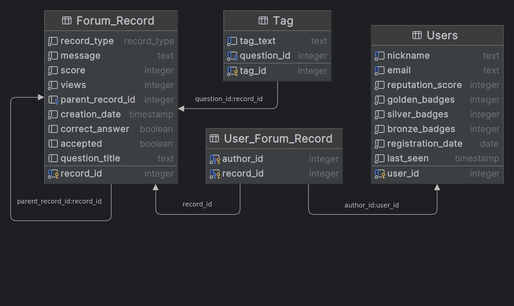

## Схема



## Преимущества схемы

Таблица Forum_Record предназначена для хранения сразу и вопросов, и ответов, и комментариев,
и вносимых изменений.
Эти четыре сущности будут образовывать сильно ветвящееся дерево, каждое из которых
описывает страницу одного конкретного вопроса.
Хранение дерева осуществляется с помощью списка смежности, что даёт следующие плюсы:
* ссылочная целостность данных;
* простая операция добавления узла в дерево - необходимо добавить узел с потомками
в таблицу и обновить parent_record_id;
* простота получения потомком 1-го уровня вложенности;
* простота получения непосредственного родителя.

Используется минимум таблиц.

Для внесения изменений будем хранить полный текст, который отображается после
внесения изменений. Это позволит быстрее формировать содержимое страницы для отображения
её у конечного пользователя. Так как у нас нет ограничения на количество изменений, которые
могут вносить пользователи (плюс изменения может предлагать не только сам автор, но
вообще любой пользователь, а автору нужно лишь их одобрить), то может сложиться ситуация,
что нужно смёржить очень большое количество изменений, чтобы получить финальный текст
вопроса, ответа или комментария, а при хранении полного текста нам нужно будет лишь найти
последнее одобренное автором изменение.


## Недостатки схемы

Контроль над тем, что лишь один ответ на вопрос помечен как верный, должен осуществляться за пределами БД: на серверном
уровне приложения.

Дерево соответсвующее странице вопроса будет иметь глубину четыре, 
поэтому для получения всех потомков в лучшем случае придётся использовать рекурсивный запрос,
а в худшем несколько запросов в базу.

В таблице Forum_Record есть три поля, в которых будет находиться значение отличное от null, только
для конкретных типов сущностей:
1. correct_answer имеет смысл только для строки таблицы, у которой поле record_type='ANSWER';
2. accepted - для record_type='EDITION';
3. question_title - для record_type='QUESTION'.

Из-за хранения нескольких сущностей в одной таблице стороне сервера не получится сделать
взаимно-однозначное отображение: класс <-> отдельная таблица в базе.
В связи с этим потребуется дополнительная логика на стороне сервера, чтобы не записать невалидные данные
в таблицу Forum_Record, например record_type='QUESTION', а correct_answer отличен от null.

Хранение полного содержания для каждого изменения многократно увеличит хранимый объём данных.

## Код для генерации схемы БД

Использовался PostgreSQL 12.16

```sql
create type record_type as enum (
    'Question',
    'Answer',
    'Comment',
    'Edition');

create table "Users"
(
    user_id           integer           not null
        constraint "Users_pk"
            primary key,
    nickname          text              not null
        constraint "Users_pk2"
            unique,
    email             text              not null
        constraint "Users_pk3"
            unique,
    reputation_score  integer default 0 not null,
    golden_badges     integer default 0 not null,
    silver_badges     integer default 0 not null,
    bronze_badges     integer default 0 not null,
    registration_date date              not null,
    last_seen         timestamp         not null
);

create table "Forum_Record"
(
    record_id        integer           not null
        constraint "Forum_Record_pk"
            primary key,
    record_type      record_type       not null,
    message          text              not null,
    score            integer default 0 not null,
    views            integer default 0 not null,
    parent_record_id integer
        constraint "Forum_Record_Forum_Record_record_id_fk"
            references "Forum_Record",
    creation_date    timestamp         not null,
    correct_answer   boolean,
    accepted         boolean,
    question_title   text
);

create table "User_Forum_Record"
(
    author_id integer not null
        constraint "User_Forum_Record_Users_user_id_fk"
            references "Users",
    record_id integer not null
        constraint "User_Forum_Record_Forum_Record_record_id_fk"
            references "Forum_Record",
    constraint "User_Forum_Record_pk"
        primary key (author_id, record_id)
);

create table "Tag"
(
    tag_id      integer not null
        constraint "Tag_pk3"
            primary key,
    tag_text    text    not null,
    question_id integer not null
        constraint "Tag_Forum_Record_record_id_fk"
            references "Forum_Record",
    constraint "Tag_pk"
        unique (question_id, tag_text),
    constraint "Tag_pk2"
        unique (tag_text, question_id)
);
```


